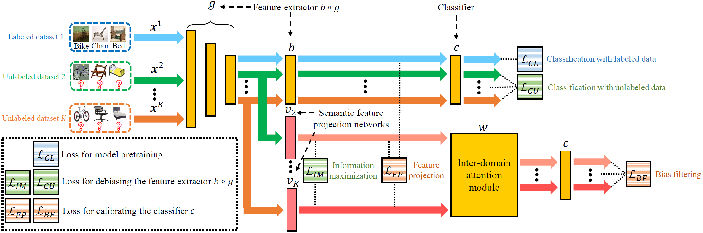

# DSBF

## Introduction
This repository contains the implementation code for paper:

**Domain-Specific Bias Filtering for Single Labeled Domain Generalization**

Junkun Yuan, Xu Ma, Defang Chen, Kun Kuang, Fei Wu, Lanfen Lin

[[arXiv](https://arxiv.org/abs/2110.00726)]

## Brief Abstract for the Paper
<p align="center">
     <br>
</p>
Domain generalization (DG) utilizes multiple labeled
source datasets to train a generalizable model for unseen target
domains. However, due to expensive annotation costs, the requirements
of labeling all the source data are hard to be met in real-world applications. 

We investigate a Single Labeled Domain Generalization (SLDG) task with only one source domain being labeled, which is more practical and challenging than the Conventional Domain Generalization (CDG). A major obstacle in the SLDG task is the discriminability-generalization bias: discriminative information in the labeled source dataset may contain domain-specific bias, constraining the generalization of the trained model. 

To tackle this challenging task, we propose Domain-Specific Bias Filtering (DSBF), which initializes a discriminative model with the labeled source data and filters out its domain-specific bias with the unlabeled source data for generalization improvement. We divide the filtering process into: (1) Feature extractor debiasing using k-means clustering-based semantic feature re-extraction; and (2) Classifier calibrating using attention-guided semantic feature projection.

## Requirements
You may need to build suitable Python environment by installing the following packages (Anaconda is recommended).
* python 3.6
* pytorch 1.7.1 (with cuda 11.0 and cudnn 8.0)
* torchvision 0.8.2
* tensorboardx 2.1
* numpy 1.19

## Data Preparation
We list the adopted datasets in the following.
| Datasets | Download link|
| -- | -- |
| PACS [1]</a> | https://dali-dl.github.io/project_iccv2017.html |
| Office-Home [2] | https://www.hemanthdv.org/officeHomeDataset.html | 
Although these datasets are open-sourced, you may need to have permission to use the datasets under the datasets' license. 

If you're a dataset owner and do not want your dataset to be included here, please get in touch with us via a GitHub issue. Thanks!

## Usage


## Citation
If you find our code or idea useful for your research, please cite our work.
```bib
@article{yuan2021domain,
  title={Domain-Specific Bias Filtering for Single Labeled Domain Generalization},
  author={Yuan, Junkun and Ma, Xu and Chen, Defang and Kuang, Kun and Wu, Fei and Lin, Lanfen},
  journal={arXiv preprint arXiv:2110.00726},
  year={2021}
}
```

## Contact
If you have any questions, feel free to contact us through email (yuanjk@zju.edu.cn) or GitHub issues. Thanks!

## References
[1] Li, Da, et al. "Deeper, broader and artier domain generalization." Proceedings of the IEEE international conference on computer vision. 2017.
[2] Venkateswara, Hemanth, et al. "Deep hashing network for unsupervised domain adaptation." Proceedings of the IEEE conference on computer vision and pattern recognition. 2017.